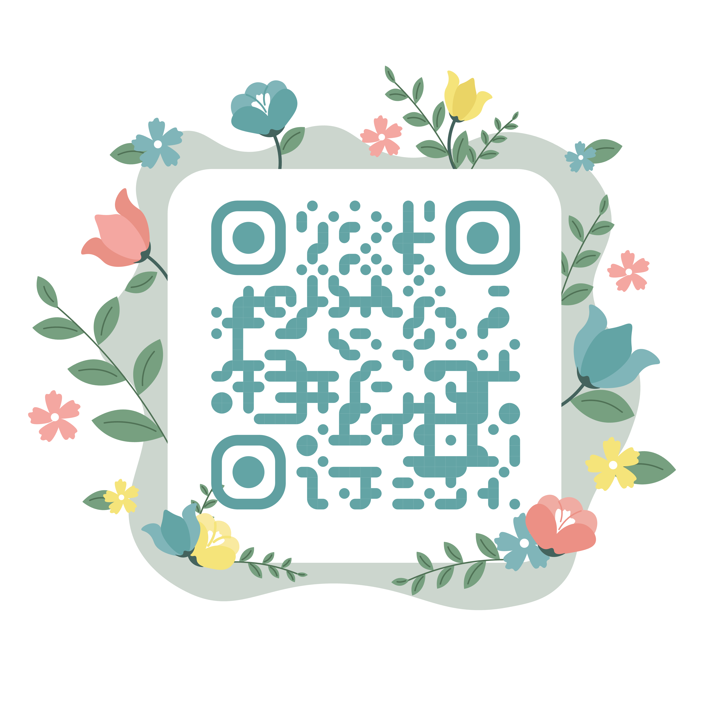
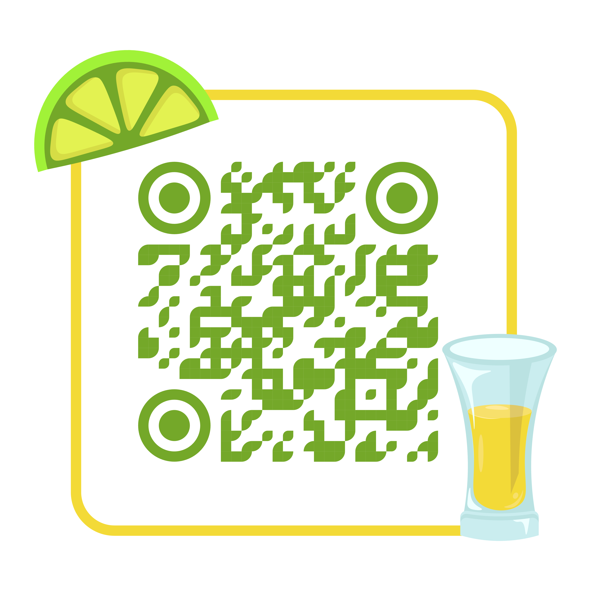
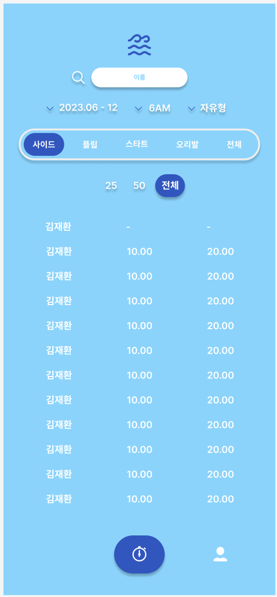
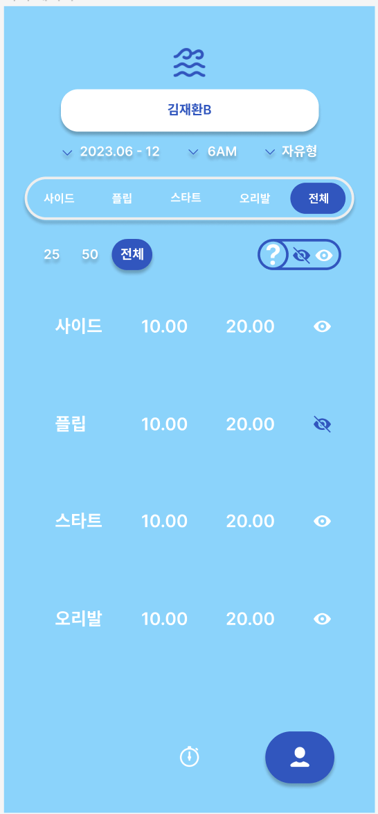

# 1️⃣ QR

## 6시

## 7시

 

# 2️⃣ 추가 페이지 설계

- 이름 입력 페이지
    - DB 에 회원 이름 미리 넣어두고, 유효성 검사 및 응답
- 마이페이지 - 본인 기록 한번에 보여주기
- 마이페이지 - 본인 기록 노출 유무 on / off

[필요한 기능과 API](https://www.notion.so/API-8af04f7528774eda91bd32181ba32002?pvs=21)

