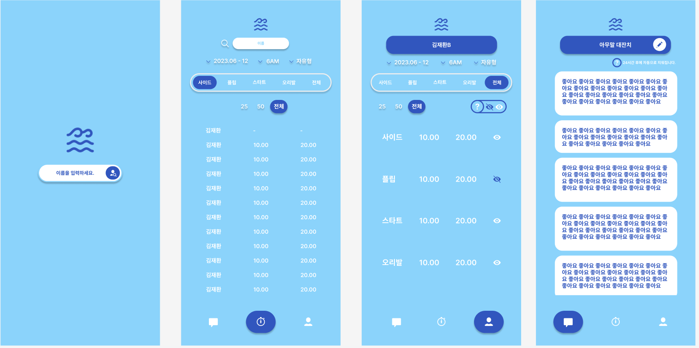

# 1️⃣ 추가 페이지 설계

- 피드백 페이지

[필요한 기능과 API](https://www.notion.so/API-8af04f7528774eda91bd32181ba32002?pvs=21)

# 2️⃣ 깃허브 만들기

https://github.com/jae-hwan-kim/RIDE-THE-WAVE

# 3️⃣ DB 설계

- ERD 클라우드 페이지 만듬

[RIDE-THE-WAVE](https://www.erdcloud.com/d/zxtC8oionFN8sdEpq)

- 설계는 내일~