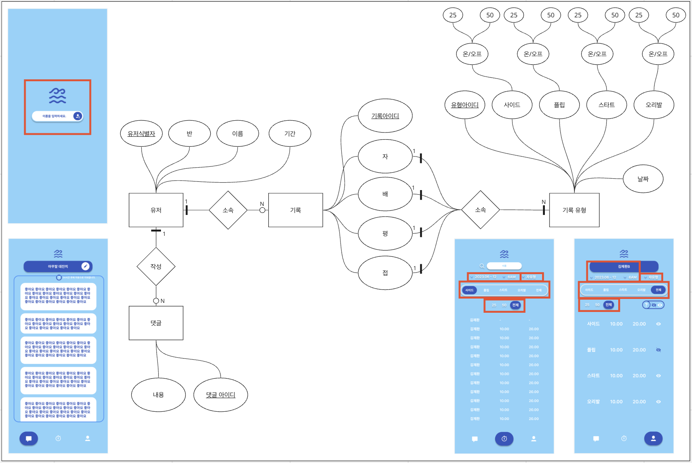
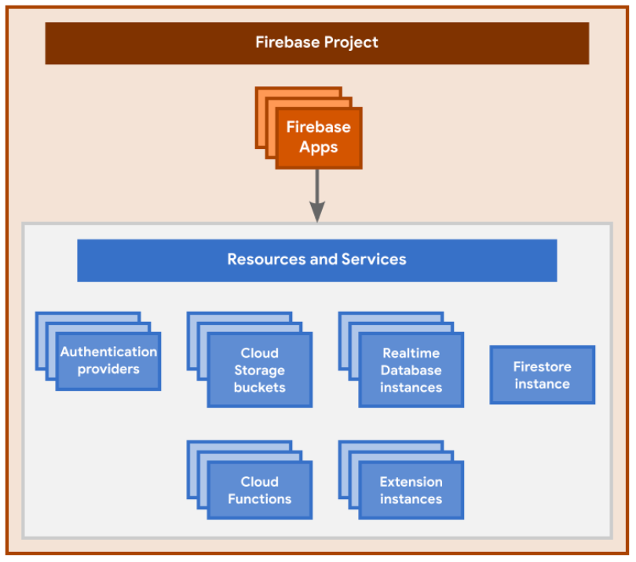

# ✓ 개념적 데이터 모델링 구체화

# 1️⃣ 파이어베이스 공부하기

[파이어베이스 공홈](https://firebase.google.com/docs/database/web/start?hl=ko)

[파이어베이스의 이해](https://firebase.google.com/docs/projects/learn-more?hl=ko)

## ✅ 흥미로운 것
* 애널리틱스를 추가할 수 있다.

* 핵심사항: Firebase 프로젝트는 실제로는 사용 설정된 Firebase 관련 구성과 서비스가 추가적으로 포함된 Google Cloud 프로젝트입니다.

* 새 Firebase 프로젝트를 만들면 내부적으로 Google Cloud 프로젝트가 생성됩니다. Google Cloud 프로젝트부터 만들고 나중에 Firebase를 프로젝트에 추가할 수도 있습니다. Google Cloud 프로젝트는 데이터, 코드, 구성, 서비스의 가상 컨테이너라고 볼 수 있습니다.

# ETC

## 파이어베이스

### A.

파이어베이스의 "오프라인 지속성(Offline Persistence)" 특징은 웹 브라우저나 모바일 앱과 같은 클라이언트 기기에서 작동하며, 사용자가 인터넷에 연결되어 있지 않을 때에도 데이터에 접근하고 변경할 수 있게 해주는 기능입니다.

"로컬 디스크"란 사용자의 클라이언트 기기, 즉 모바일 장치나 브라우저 내의 내장 스토리지 또는 로컬 캐시를 의미합니다. 파이어베이스의 오프라인 지속성은 데이터베이스 쿼리 및 데이터 동기화를 지원하여, 사용자가 오프라인 상태에서도 앱 내에서 데이터를 읽고 쓸 수 있게 해줍니다. 변경사항은 로컬 디스크에 저장되며, 다시 온라인으로 연결되었을 때 서버와 동기화됩니다.

예를 들어, 모바일 앱이 오프라인 상태에서 사용자가 데이터를 조회하거나 수정하면, 이러한 변경사항은 로컬 디스크에 저장되며, 사용자가 다시 온라인 상태가 되면 서버에 전송되어 데이터의 일관성을 유지합니다. 이로써 사용자 경험을 향상시키고 네트워크 연결이 불안정한 환경에서도 앱을 사용할 수 있게 합니다.

### A.
파이어베이스의 오프라인 지속성은 모바일 앱 및 웹 앱에서 데이터의 안정성과 가용성을 향상시키는 데 도움을 주며, 사용자가 항상 최신 데이터에 접근할 수 있도록 합니다.

파이어베이스는 관계형 데이터베이스 시스템인 PostgreSQL이나 MySQL과는 다른 데이터베이스 솔루션입니다. 파이어베이스는 NoSQL 데이터베이스인 Cloud Firestore와 Firebase Realtime Database를 사용합니다. 이러한 NoSQL 데이터베이스는 스키마가 유연하며, 실시간 데이터 동기화 및 오프라인 지속성과 같은 고유한 기능을 제공합니다.

만약 PostgreSQL이나 MySQL과 같은 관계형 데이터베이스를 사용하려면, 별도의 서버에서 해당 데이터베이스를 설정하고 호스팅해야 합니다. 이러한 관계형 데이터베이스는 복잡한 데이터 모델과 트랜잭션 처리를 필요로 하는 애플리케이션에 적합합니다. 또한 데이터 스키마가 고정적이며 데이터 무결성이 중요한 경우에 많이 사용됩니다.

파이어베이스는 주로 모바일 및 웹 앱 개발을 위한 간단하고 빠른 개발을 지원하며, 서버 관리를 최소화하고자 하는 경우에 유용합니다. 따라서 데이터베이스 선택은 프로젝트의 요구 사항과 목표에 따라 다르며, PostgreSQL이나 MySQL과 같은 관계형 데이터베이스와 파이어베이스를 병행하여 사용하는 것도 가능합니다.

## ❗️고민
* organization 을 만들어서, 메모지, 백엔드, 프론트엔드를 따로따로 레포지토리를 생성할지. 그냥 하나의 레포지토리에서 처리해야할지 고민니다...