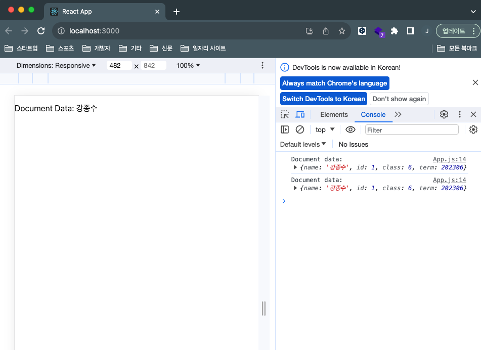

# 1️⃣ 리액트에 파이어베이스 연동

* 값 출력해보기

출력했다. 이제 UI 를 어떤 구조로 설계할지 작성한 뒤에, 데이터를 넣어보자!



```js
function App() {
  const [document, setDocument] = useState(null);

  useEffect(() => {
    const fetchData = async () => {
      const docRef = doc(firestore, "users", "user_id_001");
      const docSnap = await getDoc(docRef);
  
      if (docSnap.exists()) {
          console.log("Document data:", docSnap.data());
          setDocument(docSnap.data().name);
      } else {
          // doc.data() will be undefined in this case
          console.log("No such document!");
      }
    };

    fetchData();
  }, [])

  return (
    <div className="App">
        <p>
        {/* Document Data: {JSON.stringify(documentData)} */}
        Document Data: {document}
        </p>
    </div>
  );
}
```
