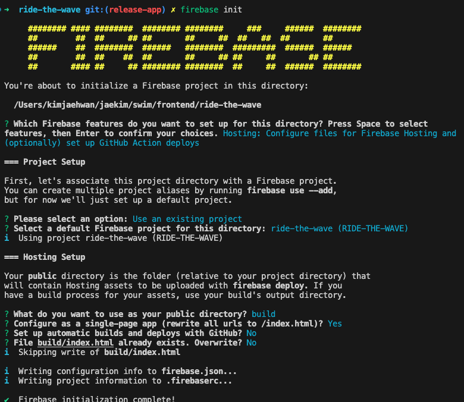

# 1️⃣ 배포하기

- [참고 영상](https://www.youtube.com/watch?v=VZSkN9wLRoQ)
- [참고 공식 홈페이지](https://console.firebase.google.com/project/ride-the-wave/hosting/sites/ride-the-wave)

1. `npm install -g firebase-tools` 으로 설치

2. `firebase login`

3. firebase init 전에 `npm run build` 함.

4. `firebase init`

    

5. `firebase deploy`

## 배포 결과 사이트

[ride-the-wave](https://ride-the-wave.firebaseapp.com/?_gl=1*mbjlcg*_ga*ODU1NjIyOTgxLjE2OTc0NTI2MDE.*_ga_CW55HF8NVT*MTY5ODM4MzUzNy4xMy4xLjE2OTgzODUxOTMuNjAuMC4w)

# ETC

* 빠르게 배포만 하려고 하는 것이기 때문에 깃허브 연동없이 빌드 후 배포했다.

* 추후 참고하면 좋을 것 같은 [사이트](https://ahnslab.com/029-start-react-without-next/#firebase-%ED%94%84%EB%A1%9C%EC%A0%9D%ED%8A%B8-%ED%99%98%EA%B2%BD-%EC%84%B8%ED%8C%85)

# 이제 해야할 것?

* CSS 다듬기

    * 하단바 고정으로 변경하고 싶다. [참고 할 블로그](https://velog.io/@gym/React-React%EB%A1%9C-%ED%95%98%EB%8B%A8%ED%83%AD-%EB%A7%8C%EB%93%A4%EA%B8%B0)

    * 테두기 지우기
    
    * 필요한 이미지 넣기

    * 반응형 없이, 브라우저 용은 없게 만들어 볼까? 모바일 사이즈로만 구현해볼까?