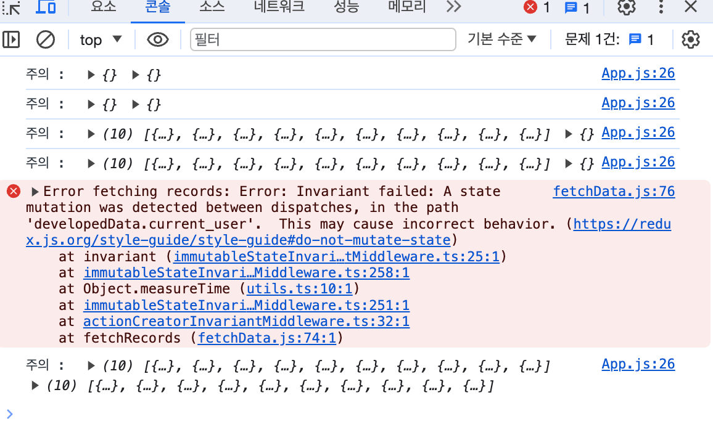

# 1️⃣ 파이어베이스 적용하기

## 전체 기록 페이지

### 필요한 데이터 및 로직

2. 거리 옵션 ( 25, 50, 전체 ) 에 따라 데이터 렌더링 하기 ✅
    * 이때 기록을 보이지 않기를 원하는 유저의 데이터는 가리기 ❗️

## 익명 게시판 페이지

### 필요한 데이터 및 로직

⭐️ 2, 3, 4, 5 로직에서는 db 값이 변경된다. 그렇기 때문에 전역 데이터를 수정하고 렌더링하는 과정이 필요하다. 

1. 리뷰 데이터 렌더링 하기 ✅

2. 리뷰 모달 화면에서 게시 누르면 db 에 저장하고 모달 닫은 뒤, 리뷰 재랜더링하기

3. 작성자 유효성 체크해서 본인이 작성한 글일 경우 리뷰 박스에 수정 삭제 버튼 보이게 하기

4. 수정 누르면 수정된 데이터 db 에 갱신하고, 리뷰 재랜더링하기

5. 삭제 누르면 해당 데이터 db 에서 삭제하고, 리뷰 재랜더링하기

# 해야할 것

* 리덕스 수정하기. 불변성 확보하기.

* 문제 발견

    아래 에러가 계속 발생했다. 왜일까 봤는데, 페이지 이동 전에 로드가 되어있어야할 데이터가 없어서 에러가 발생했다.

    

    ```js
    function App() {
        const dispatch = useDispatch();

        useEffect(() => {
            fetchUsers(dispatch);
            fetchRecords(dispatch);
            fetchComments(dispatch);
        }, []);
        
        const users = useSelector((state) => state.users);
        const records = useSelector((state) => state.records);

        useEffect(() => {
            console.log('주의 : ', users, records);
            fetchDevelopedData(users, records, dispatch);
        }, [users, records]);

        return (
            <Router>
                <Suspense fallback={<Loading />}>
                    <Routes>
                    <Route path="/" element={<Login />} />
                    <Route path="/review" element={<Comments />} />
                    <Route path="/grouprecords" element={<GroupRecords />} />
                    <Route path="/myrecord" element={<MyRecord />} />
                    </Routes>
                </Suspense>
            </Router>
        );
    }
    ```
    위 코드에 `useEffect` 가 두번 있고, 모두 마무리 된 후에 페이지 이동을 해야한다. 왜냐하면 페이지에서 활용할 데이터들을 로드한 후에 이동해야하기 때문이다.

    로드 전에 페이지 이동을 하니 위 에러가 발생한다...