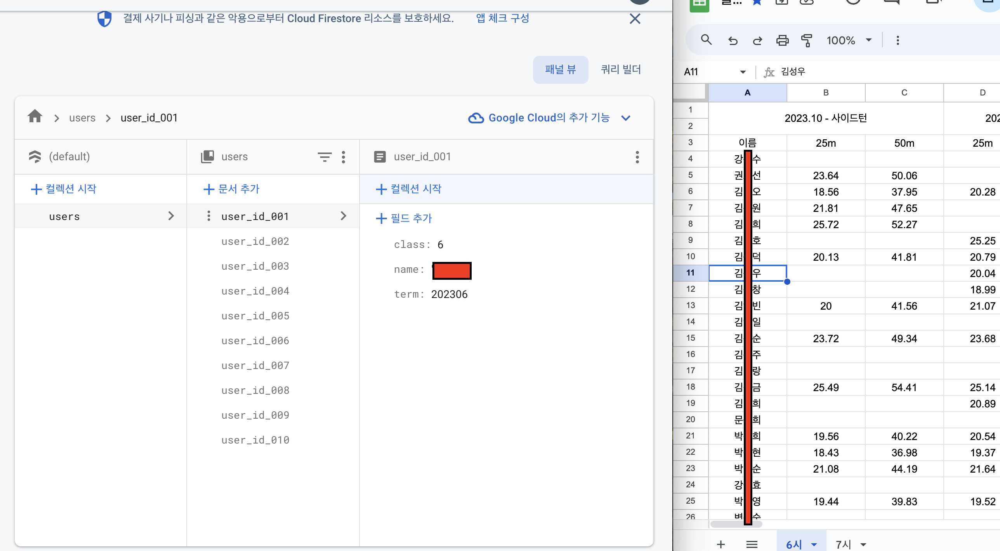

# 1️⃣ 파이어베이스에 데이터 입력하기

* 전혀 좋아보이지 않지만, 직접 입력을 하고 있는 작업을 하고 있다... 10명 데이터만 넣고 개발 진행한 뒤, 추가 작업을 진행할 예정이다.


* 댓글에 `available` 속성을 추가하자. 삭제인지 아닌지를 체크하는 용도로 사용하자!

  댓글은 적은 목데이터로 구현하고, UI 위치 잡은 다음에 추가 삭제 구현하자.

```json
"comments" : {
    "comment_id_00001" : {
        "id" : 1,
        "user" : "user_id_1", // 김재환 작성한 댓글
        "content" : "댓글 내용...",
        "available" : true
    },
    "comment_id_00002" : {
        "id" : 2,
        "user" : "user_id_2", // 영희가 작성한 댓글
        "content" : "다른 댓글 내용...",
        "available" : true
    },
    // 다른 댓글들...
},
```

# 고민사항 & 아쉬운점

* 파이어베이스에 문서를 추가할 때, 아이디가 다음과 같은 형태다. 그 이유는 문서를 string 으로 인식하기 때문에, 뒤에 숫자를 자릿수 없이 문자열의 형태로 넣으면 아스키코드로 인식해서 정렬에 문제가 발생하기 때문이다.

  일단 자릿수를 같이 넣었는데, 다른 방식이 없는지 찾아봐야겠다...
  혹시 모르니,,, 식별자를 number 로 넣어주자...

```json
comment_id_00001
comment_id_00002
comment_id_00003
comment_id_00004
```

* 파이어베이스 콘솔에서 데이터를 직접 입력할 때, 문서는 수정이 안된다...! 이게 무슨일이고....

* 기록을 입력할 때 컬렉션 안에 컬렉션을 만들었는데 잘 동작될지 모르겠다.