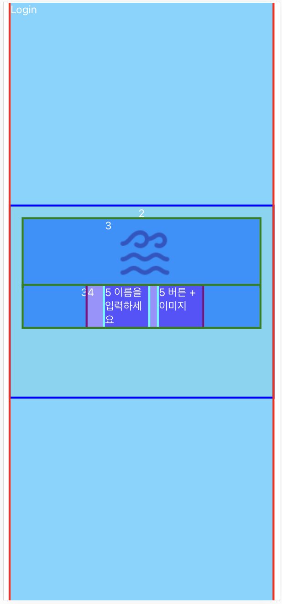
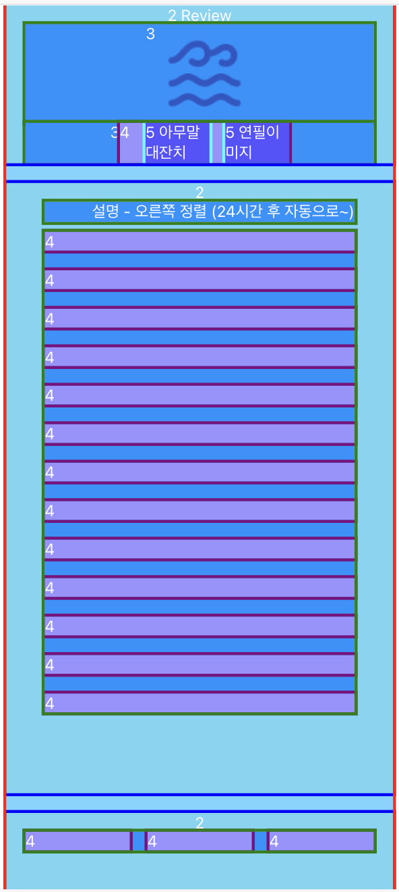
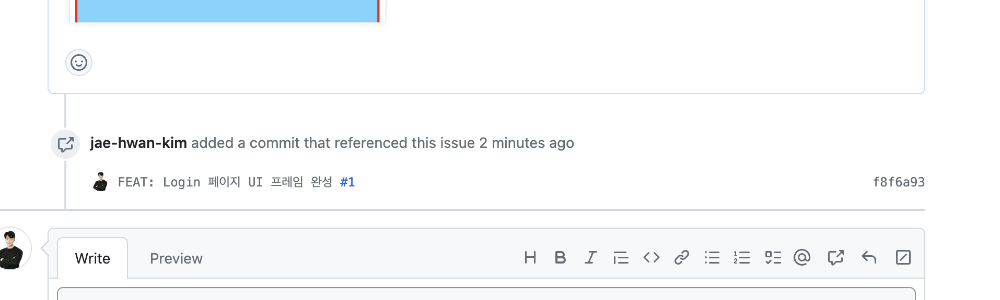

# 1️⃣ ui 구현
    * Login 페이지 div 구현 (위치 조정 css 는 아직 안함)

# 2️⃣ css 고민

* [css 관련 블로그1](https://www.couchcoding.kr/blogs/couchcoding/%EB%A6%AC%EC%95%A1%ED%8A%B8%20%EC%BB%B4%ED%8F%AC%EB%84%8C%ED%8A%B8%EC%97%90%20CSS%20%EC%A0%81%EC%9A%A9%ED%95%98%EA%B8%B0%20-%20%EB%A7%8E%EC%9D%B4%20%EC%82%AC%EC%9A%A9%ED%95%98%EB%8A%94%204%EA%B0%80%EC%A7%80%20%EA%B8%B0%EC%88%A0%20%10%EC%A0%95%EB%A6%AC)

* [css 관련 블로그2](https://velog.io/@sorious77/React-CSS-%EC%A0%81%EC%9A%A9%ED%95%98%EA%B8%B0)

* 레이아웃과 관련된 공통적인 부분은 tailwind CSS 으로 하고 그 외에는 컴포넌트 별로 폴더 별로 캡슐화 및 CSS Module(중복 문제 해결 가능) 을 사용하자

    -> tailwind 러닝커브가 있을 수 있기 떄문에 일단 그냥 css 를 사용하고 추후에 수정하자

# 2️⃣ 레이아웃 고민

* [레이아웃 관련 블로그](https://the-next-web-research-lab.tistory.com/117)

* flex 와 grid 고민

* 흠... 모바일을 주 UI 로 생각하고 있지만, 웹앱을 만들려고 한다. 첫 배포는 모바일용으로 만들자. 그리고 추후에 PC 용 UI 도 디자인해보자.

* Grid 를 사용해보자. Grid 까지 사용할 프로젝트는 아니지만, 추후 확장을 하게 된다면 생각의 폭을 좁히지 않기 위해 Grid 를 사용하자. 사실 둘다 제대로 사용해본적이 없는... 경험 없는 비교여서 고민이 의미 있을까 싶긴 하지만, 어떤 생각이든 의미없는 건 없으니까!!! 고!!
    * flex 는 1차원, grid 는 2차원으로 레이아웃을 관리할 수 있다는 차이가 있다고 한다.

* grid 와 flex 를 둘다 사용해야할 것 같다. grid 로 전체 틀은 잡아줬다. 각 그리드 셀 안의 div 에 대한 레이아웃은 복잡한 레이아웃을 갖지 않을 것이기 떄문에 flex 로 하면 적절할 것 같다. 추후 확장을 고려해도 ux 도 고려하여 복잡하게 하지 않을 것이기 때문에 괜찮을 것 같다.

* [참고 영상](https://www.youtube.com/watch?v=sgyibPa-2i8)

## 페이지 UI 프레임 구현

* Login & Review

 

# 3️⃣ ETC
* [이미 푸시한 커밋 메시지 수정](https://velog.io/@dev_bomdong/Git-%EC%9D%B4%EB%AF%B8-push%ED%95%9C-commit-message-%EC%88%98%EC%A0%95%ED%95%98%EA%B8%B0)하기
    * 커밋을 이슈에 연결하고 싶었다. `#이슈넘버`를 붙어야하는데 깜박했다는 것... 그래서 어떻게 해야하는지 찾아보고 진행함... 근데 --force 는 사용하지 않는게 좋은 거 같은데, 그러면 어떤 방법을 사용해야하는거지?

    