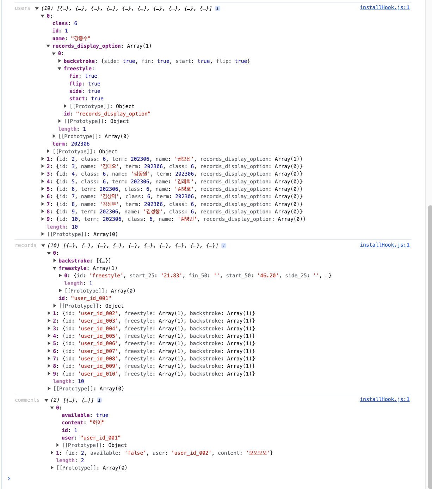

# 1️⃣ 파이어베이스 적용하기

* Root 에서 데이터를 모두 읽어온 다음에, 활용하는 방식으로 해야겠다.

    1. 컬렉션의 문서 데이터 모두 가져오기 ✅

    2. 컬렉션의 하위 컬렉션 모두 가져오기 ✅
        

    3. 가져온 데이터 가공하기 ✅

        ```json
            developData {
                "current_user" :,
                "auth" : ,
                "own_record" : {
                    "freestyle" : ,
                    "backstroke" : ,
                },
                {   // 전체 기록
                    "id" : ,
                    "user" : ,
                    "name" : ,
                    "term" : ,
                    "class" : ,
                    "records_display_option" : {
                        "freestyle" : ,
                        "backstroke" :,
                    },
                }
            }
        
        ```

* 필요한 데이터 및 로직 정리하기

    ## 로그인 페이지

    ### 필요한 데이터

    1. 전체 데이터를 읽어오기 - 데이터 구조화 하기 ✅

        * 이름
        * 기간
        * 수업 시간
        * 25 & 50m 기록
        * 리뷰

    ### 필요한 로직

    2. 돋보기 눌렀을 때 ✅
        
        * 인풋에 입력된 값이 읽어온 데이터와 비교해서 회원인지 아닌지 비교해서 권한 속성 부여하기

            * ⭐️ 구조체로 처리하거나, bool 타입 전역변수를 만들어서 유효성 검사가 필요한 부분에서 활용하도록 하는 것도 좋을 거 같다. ✅ auth 추가

    
    ## 개인 기록 페이지

    ### 필요한 데이터 및 로직

    1. 로그인에서 가져온 유저 데이터로 상단바 데이터 채우기

        * 이름 ✅
        * 기간 ✅
        * 수업 시간 ✅
        * 25 & 50m 기록 ✅

        ❗️유효하지 않다면 어떻게 할까?? -> - 로 표하기 ✅

    2. 기록 옆에 눈 이미지를 클릭하면 전체 기록페이지에서 안보이도록 이미지 상태 체크를 위한 변수가 회원의 turn type 기록 당 존재해야 한다.
        * ⭐️ 이 로직에서는 db 값이 변경된다. 그렇기 때문에 전역 데이터를 수정하고 렌더링하는 과정이 필요하다.

    ## 전체 기록 페이지

    ### 필요한 데이터 및 로직

    1. 수업 시간에 따라 유저를 찾고, turn type 에 따라 데이터 렌더링하기

    2. 거리 옵션 ( 25, 50, 전체 ) 에 따라 데이터 렌더링 하기
        * 이때 기록을 보이지 않기를 원하는 유저의 데이터는 가리기

    2. 서치 바에 이름을 입력하고 돋보기 버튼을 누르면 해당하는 유저를 하단의 데이터에서 찾아서 렌더링하기

    ### 있으면 좋을 것 같은 기능

    1. DB 에 없는 유저라면 기록의 이름이 안보이게 하기

    ## 익명 게시판 페이지

    ### 필요한 데이터 및 로직

    ⭐️ 2, 3, 4, 5 로직에서는 db 값이 변경된다. 그렇기 때문에 전역 데이터를 수정하고 렌더링하는 과정이 필요하다.

    1. 리뷰 데이터 렌더링 하기

    2. 리뷰 모달 화면에서 게시 누르면 db 에 저장하고 모달 닫은 뒤, 리뷰 재랜더링하기

    3. 작성자 유효성 체크해서 본인이 작성한 글일 경우 리뷰 박스에 수정 삭제 버튼 보이게 하기

    4. 수정 누르면 수정된 데이터 db 에 갱신하고, 리뷰 재랜더링하기

    5. 삭제 누르면 해당 데이터 db 에서 삭제하고, 리뷰 재랜더링하기

# 음..

* 파이어 스토어에서 받아온 데이터를 가공해서 전역으로 사용하려고 했다. 그랬더니 컴포넌트 간 이동할 때, prop으로 전달하는 데이터들이 재귀(?) 를 도는 듯한 모습을 보이며 참조하기 어렵게 됐다. 예를 들면 이렇다.

```json
// 처음 개인기록 컴포넌트
"data" : {
    // 데이터가 있음
}

// 다른 컴포넌트에 prop으로 전달 후 다시 개인 기록 컴포넌트로 prop 받아왔을 때
"data" : {   
    "data" : {
        // 데이터가 있음
    }
}

// 다시한번 다른 컴포넌트에 prop으로 전달 후 다시 개인 기록 컴포넌트로 prop 받아왔을 때
"data" : {   
    "data" : {
        "data" : {
            // 데이터가 있음
        }
    }
}
```

그래서 redux에 가공한 데이터도 추가했다. 어떻게 보면 prop 으로 생긴 의존성을 없앤게 아닐까 생각이든다.

* 리덕스 값을 수정하는데 조금 문제가 있다. 이부분은 공부를 더 해야할 것 같다.